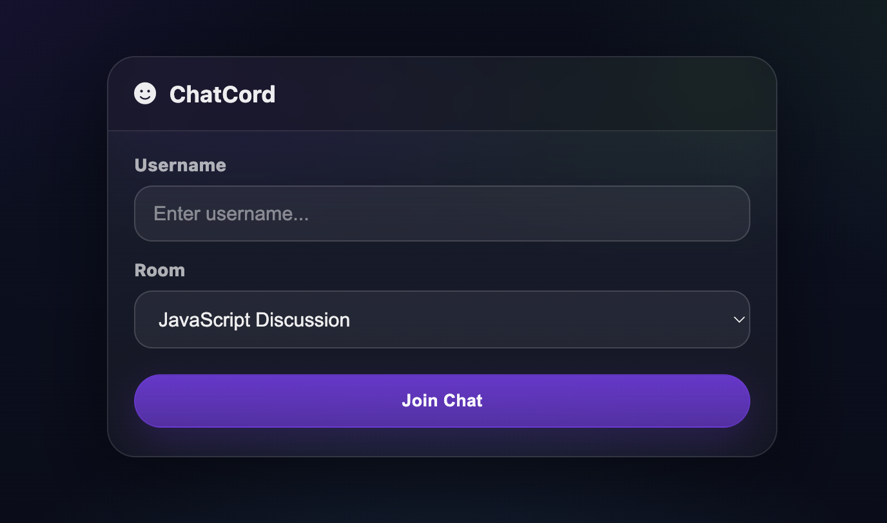
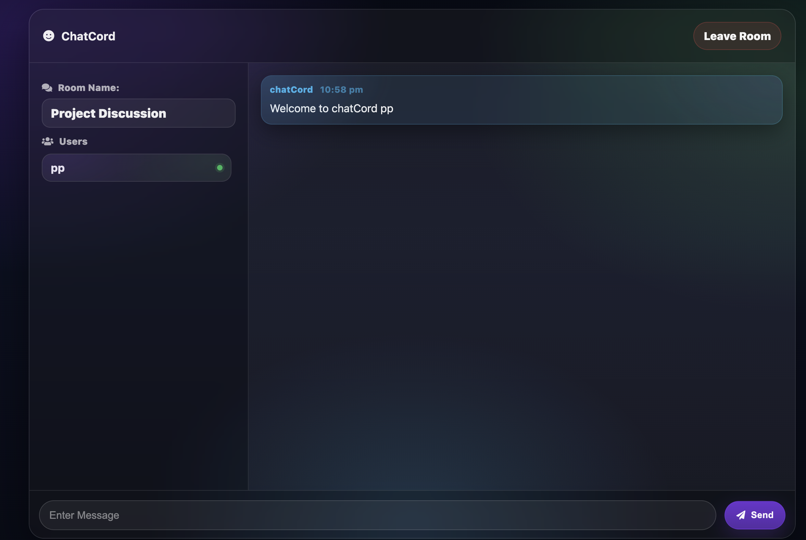
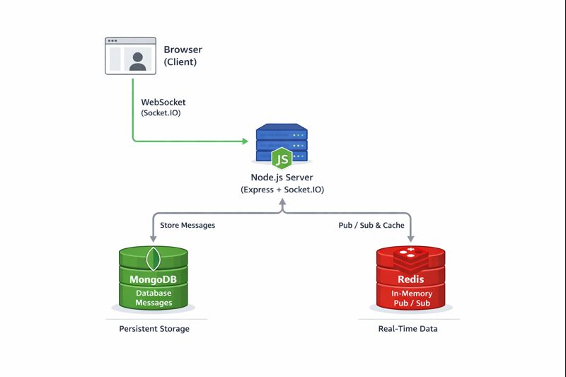
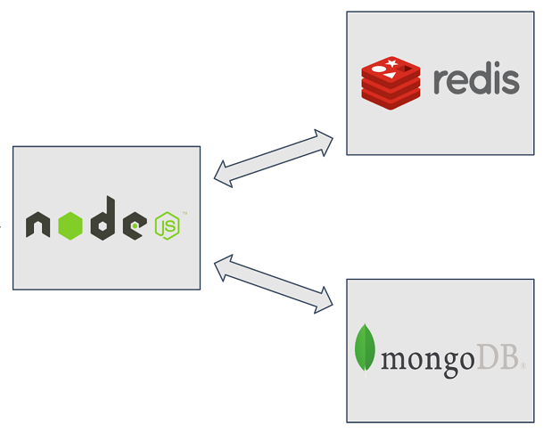

# 🚀 ChatCord — Real-Time Chat Application


🔗 **Live Application**  
👉 https://flying-rheba-student13-75d1d153.koyeb.app/

📦 **Docker Image**  
👉 https://hub.docker.com/r/praharsh13/chatapp

---

## 🧠 What is ChatCord?

**ChatCord** is a real-time chat application built to demonstrate **production-style backend architecture** using WebSockets, persistence, caching, and container orchestration.

It supports:
- Multiple chat rooms  
- Live user presence  
- Persistent message history  
- Scalable real-time communication  

The entire system is **fully containerised** and deployed publicly using Docker images.





---

## ✨ Features

- Real-time messaging with Socket.IO  
- Multiple chat rooms  
- Live user join and leave updates  
- Message history stored in MongoDB  
- Redis for fast in-memory operations and pub/sub  
- Fully Dockerised (app, MongoDB, Redis)  
- Clear separation between development and deployment  

---

## 🧰 Tech Stack


---

## 🏗 Architecture Overview

### High-Level System Architecture




### Why this architecture matters

- **Socket.IO** enables real-time, bi-directional communication  
- **MongoDB** provides persistent message storage  
- **Redis** supports fast state updates and pub/sub patterns  
- **Docker** ensures consistency across environments  




---

## 📂 Project Structure

.
├── index.js
├── package.json
├── Dockerfile
├── docker-compose.yml
├── public/
│ ├── css/
│ ├── js/
│ └── html/
└── README.md


---

## ⚙️ Environment Variables

| Variable | Description |
|--------|-------------|
| PORT | Port the app listens on |
| MONGO_URL | MongoDB connection string |
| REDIS_URL | Redis connection string |

Injected via Docker or the hosting platform.

---

## ▶️ Local Development

### Prerequisites
- Docker  
- Docker Compose  

### Run locally

```bash
docker compose up -d --build
Open:

arduino
Copy code
http://localhost:3000
🌍 Deployment (Docker + Koyeb)
This project is deployed using Docker images and Docker Compose on Koyeb.

Deployment workflow
Build and push the app image

bash
Copy code
docker build -t praharsh13/chatapp:latest .
docker push praharsh13/chatapp:latest
Compose-based deployment

App container

MongoDB container

Redis container

Internal Docker networking

Koyeb configuration

Dockerfile builder

Dockerfile.koyeb

Privileged mode enabled

Port 3000 exposed

Live access


https://flying-rheba-student13-75d1d153.koyeb.app/
🚀 What This Project Demonstrates
Real-time systems using WebSockets

Backend scalability patterns

Docker-based deployments

Production-style service separation

Practical use of Redis and MongoDB

Debugging real cloud deployment issues

This project mirrors how real-world backend systems are built and deployed.

🔮 Future Improvements
Authentication and private rooms

Message delivery acknowledgements

Rate limiting and moderation tools

Reverse proxy and HTTPS termination

Horizontal scaling with Redis adapters

📜 License
MIT License

© 2025 Praharsh Pranjal


